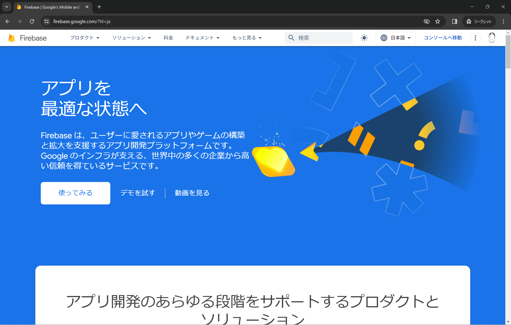
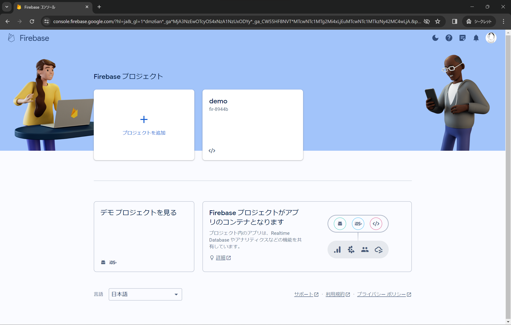
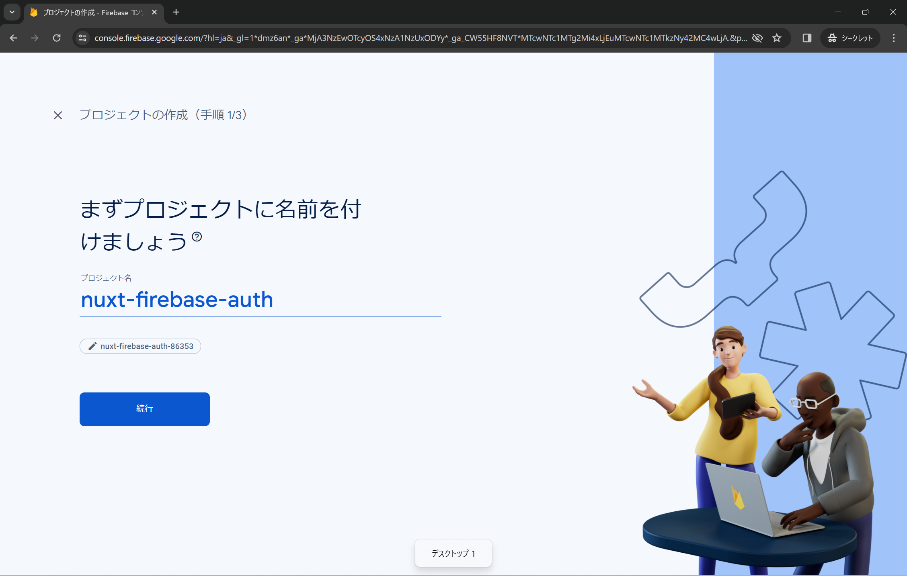
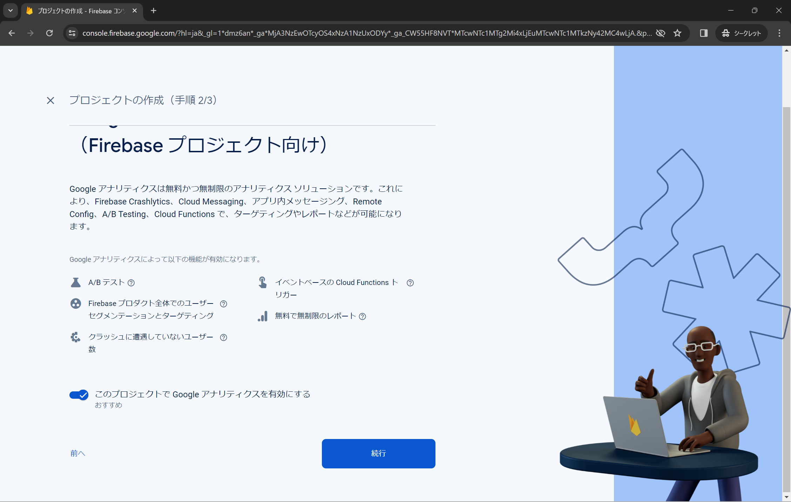
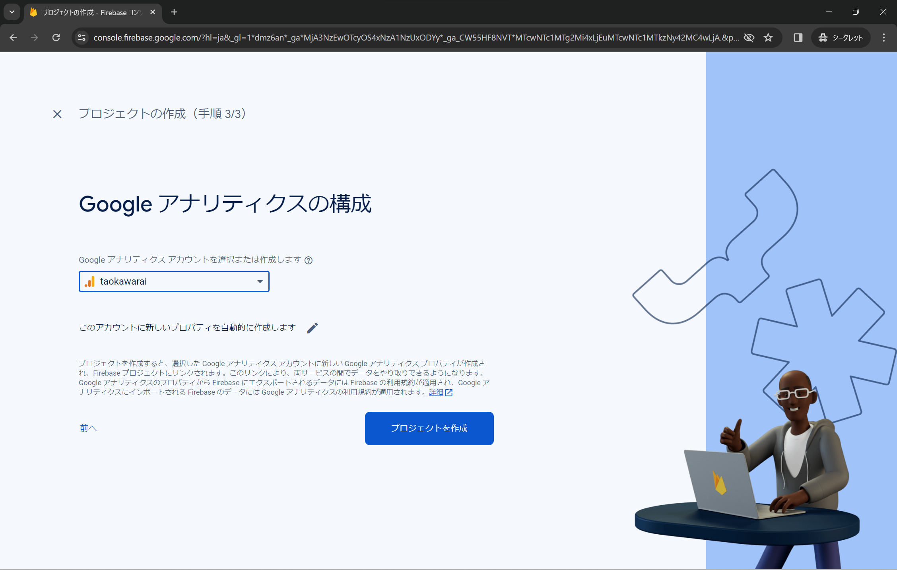
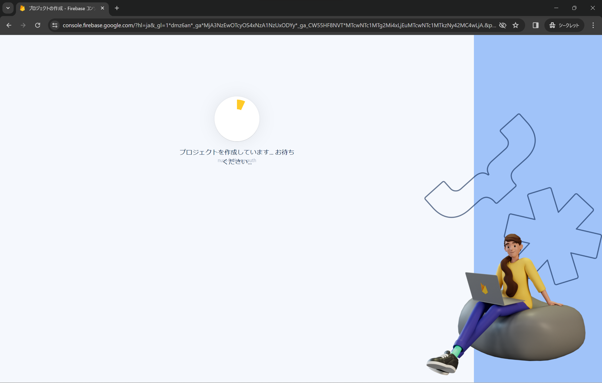

# nuxt-firebase-auth

|         | version | link                          | 
| ------- | ------- | ----------------------------- | 
| nvm     | 1.1.11  | https://github.com/nvm-sh/nvm | 
| Node.js | 20.10.0 | https://nodejs.org/en         | 
| Vue.js  | 3.4.15  | https://vuejs.org/            | 
| Nuxt    | 3.9.3   | https://nuxt.com/             | 
| npm     | 10.2.3  | https://www.npmjs.com/        | 

# make project
```sh
└$ nvm --version
1.1.11

└$ node --version
v20.10.0

└$ npx nuxi@latest init src

✔ Which package manager would you like to use?
npm
◐ Installing dependencies...                                                                                                                              20:23:40

> postinstall
> nuxt prepare

✔ Types generated in .nuxt                                                                                                                               20:25:07

added 735 packages, and audited 737 packages in 1m

125 packages are looking for funding
  run `npm fund` for details

5 high severity vulnerabilities

To address issues that do not require attention, run:
  npm audit fix

To address all issues (including breaking changes), run:
  npm audit fix --force

Run `npm audit` for details.
✔ Installation completed.                                                                                                                                20:25:07   

✔ Initialize git repository?
No
                                                                                                                                                          20:25:31  
✨ Nuxt project has been created with the v3 template. Next steps:
 › cd src                                                                                                                                                 20:25:31  
 › Start development server with npm run dev  

└$ cd .\src\

└$ npm list vue
nuxt-app@ C:\Users\TaoKawarai\Documents\study\nuxt-firebase-auth\src
├─┬ nuxt@3.9.3
│ ├─┬ @nuxt/vite-builder@3.9.3
│ │ ├─┬ @vitejs/plugin-vue-jsx@3.1.0
│ │ │ └── vue@3.4.15 deduped
│ │ ├─┬ @vitejs/plugin-vue@5.0.3
│ │ │ └── vue@3.4.15 deduped
│ │ └── vue@3.4.15 deduped
│ ├─┬ @unhead/vue@1.8.10
│ │ └── vue@3.4.15 deduped
│ ├─┬ unplugin-vue-router@0.7.0
│ │ └─┬ @vue-macros/common@1.10.1
│ │   └── vue@3.4.15 deduped
│ └── vue@3.4.15 deduped
├─┬ vue-router@4.2.5
│ └── vue@3.4.15 deduped
└─┬ vue@3.4.15
  └─┬ @vue/server-renderer@3.4.15
    └── vue@3.4.15 deduped

└$ npm --version
10.2.3
```

# add pages

```sh
// at .\src\
└$ mkdir pages
```

- src\pages\index.vue
```diff
+<template>
+  <h1>Index page</h1>
+</template>
```

- src\pages\mypage.vue
```diff
+<template>
+  <h1>My page</h1>
+</template>
```

- src\app.vue
```diff
<template>
  <div>
-   <NuxtWelcome />
+   <NuxtPage />
  </div>
</template>
```

# create Firebase project
- Log in: https://firebase.google.com/



- Move to console






